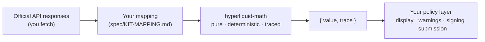

<h1 align="center">hyperliquid-math</h1>

<p align="center">
  Deterministic Hyperliquid math on plain decimal strings.<br>
  No network I/O; every result carries a calculation trace.
</p>

<p align="center">
  <a href="https://github.com/Minnzen/hyperliquid-math/actions/workflows/ci.yml"></a>
  
  
  
  
  
</p>

<p align="center">
  <a href="README.zh-CN.md">简体中文</a> ·
  <a href="https://minnzen.github.io/hyperliquid-math/">Documentation</a> ·
  <a href="spec/README.md">Formula manual</a> ·
  <a href="SKILL.md">AI-agent guide</a>
</p>

---

## What it does

- **Exact decimal arithmetic.** Every value is a decimal string; arithmetic runs on 40-significant-digit
  decimals, and quantization rounds in the direction that is conservative for the user — down for size and
  buy prices, up for sell prices. Monetary values never pass through floating point.
- **A trace on every result.** Each function returns `{ value, trace }`. The trace records the normalized
  inputs, the formula and source IDs, each rounding decision, and each assumption, so any output can be
  traced back to the rule it came from.
- **Covers the derived formulas.** Liquidation-price root solving across margin tiers (with maintenance
  deductions and backstop thresholds), account margin evaluation, PnL attribution, funding, fees, order
  previews, TWAP/scale schedules, ledger replay, spot units, and HIP-1/HIP-3 constraints.
- **Checked against the official SDK and live data.** 1,100+ tests at 100% coverage of the runtime source,
  a pinned official Python SDK oracle in CI, and dated live-API fixtures. A
  [replayable live comparison](scripts/oracles/manual-live-verify.mjs) runs against a public account with 82
  open positions: computed margin totals matched the server to 10 decimal places, and 48 of 50 liquidation
  prices matched within 0.1% (the remaining two are far-out-of-the-money roots that shift with snapshot
  timing).

## Install

```sh
npm install hyperliquid-math    # or pnpm / yarn / bun
```

ESM-only. Node ≥ 22 (also runs in browsers — CI verifies byte-identical results in Chromium).

## Example: computing a liquidation price

The package computes; **you** fetch and map. Field-by-field mapping is documented in
[`spec/KIT-MAPPING.md`](spec/KIT-MAPPING.md) — this example is the real thing, verified against
mainnet:

```ts
import { calculatePerpLiquidationPrice } from 'hyperliquid-math/liquidation'
import { quantizePrice } from 'hyperliquid-math/precision'

const info = (body: object) =>
  fetch('https://api.hyperliquid.xyz/info', {
    method: 'POST',
    headers: { 'Content-Type': 'application/json' },
    body: JSON.stringify(body),
  }).then((r) => r.json())

const user = '0x…' // any address
const [[meta, ctxs], state] = await Promise.all([
  info({ type: 'metaAndAssetCtxs' }),   // [meta, assetCtxs] aligned by universe index
  info({ type: 'clearinghouseState', user }),
])

// Map official fields -> Math inputs (numbers become strings; objects are rebuilt exactly).
// A cross liquidation price depends on the WHOLE account, so map every position.
const tables = new Map(meta.marginTables.map(([id, t]) => [id, t.marginTiers]))
const indexByCoin = new Map(meta.universe.map((u, i) => [u.name, i]))
const toPosition = ({ position: p }) => {
  const i = indexByCoin.get(p.coin)
  return {
    asset: { network: 'mainnet', marketKind: 'perp', dex: null, index: i },
    signedSize: p.szi,                       // already signed; negative = short
    entryPrice: p.entryPx,
    markPrice: ctxs[i].markPx,               // official mark, already a decimal string
    marginMode: { kind: 'cross' }, // isolated positions map differently — see KIT-MAPPING.md
    // Low-numbered marginTableIds are implicit single-tier tables absent from marginTables.
    marginTiers: (
      tables.get(meta.universe[i].marginTableId) ??
      [{ lowerBound: '0', maxLeverage: meta.universe[i].maxLeverage }]
    ).map((t) => ({ lowerBound: t.lowerBound, maxLeverage: String(t.maxLeverage) })),
  }
}

const coin = 'BTC'
const i = indexByCoin.get(coin)
const result = calculatePerpLiquidationPrice({
  targetAsset: { network: 'mainnet', marketKind: 'perp', dex: null, index: i },
  crossAccountValue: state.crossMarginSummary.accountValue,
  positions: state.assetPositions.map(toPosition),
})

if (result.value.status === 'ok') {
  const display = quantizePrice({
    value: result.value.data.liquidationPrice,   // full precision, e.g. '57620.2531645569…'
    marketKind: 'perp',
    szDecimals: meta.universe[i].szDecimals,
    rounding: 'down',
  })
  console.log('liquidation price:', display.value.status === 'ok' && display.value.data.value)
  console.log('distance to liq:', result.value.data.adverseDistanceRatio)
}
```

Every function follows the same contract — plain-data in, `{ value, trace }` out, and it never
throws:

```ts
value.status === 'ok'              // → value.data
value.status === 'invalid-input'   // → value.issues: [{ code, path, actual, expected }]
value.status === 'not-applicable'  // → the math has no answer here (e.g. flat position)
value.status === 'indeterminate'   // → a declared rule was incomplete
```

Validation errors are specific — the `expected` field states the exact keys or format required, so most
mapping mistakes are clear from the first error.

## What's inside

| Subpath | Functions |
| --- | --- |
| `/precision` | `canonicalizeDecimalString` · `quantizePrice` · `quantizeSize` |
| `/identifiers` | `deriveCanonicalAssetKey` · `encodeAssetId` · `decodeAssetId` |
| `/orderbook` | `calculateBookMetrics` · `simulateBookFill` |
| `/fees` | `calculateTradeFee` · `calculateWeightedFeeVolume` · `selectFeeTier` |
| `/positions` | `calculatePerpUnrealizedPnl` · `projectPerpFill` · `projectPerpFillSequence` · `calculatePerpBreakEvenPrice` |
| `/funding` | `calculateFundingPremiumIndex` · `calculateFundingRate` · `calculateFundingPayment` · `annualizeFundingRate` |
| `/margin` | `calculatePerpInitialMargin` · `calculatePerpMaintenanceMargin` · `evaluatePerpAccountMargin` |
| `/liquidation` | `calculatePerpLiquidationPrice` |
| `/scenarios` | `simulatePerpAccountScenario` |
| `/orders` | `validatePerpOrder` · `calculatePerpMaxOrderSize` · `evaluatePerpReduceOnly` · `calculatePerpSlippagePrice` · `classifyPerpTrigger` · `derivePerpTriggerPrice` · `buildPerpScaleLadder` · `calculatePerpTwapSchedule` |
| `/reconciliation` | `replayPerpAccountEvents` · `reconcilePerpAccountSnapshot` |
| `/spot` | `convertSpotTokenUnits` · `calculateSpotOrderDeltas` · `projectSpotPositionEvent` · `calculateSpotPortfolioValue` · `evaluateSpotDustEligibility` · `projectSpotDustAllocation` |
| `/hip1` | `validateHip1Deployment` · `evaluateHip1AnchorGenesisEligibility` |
| `/hip3` | `resolveHip3CollateralSource` · `evaluateHip3MarginMode` · `calculateHip3FeeRates` |

Formulas, derivations, 45 hand-checkable worked examples, and per-function oracle coverage live in
the [spec manual](spec/README.md), which ships inside the package.

## The boundary



This package deliberately does **not**: fetch, cache, sign, or submit anything; decide freshness,
severity, or blocking policy; or predict server acceptance, queue position, actual fills,
liquidation execution, or ADL. Server-authoritative values (effective fee tier, final funding
settlements) are inputs or comparison evidence, never outputs. The full statement of what stays on
your side of the line is in [`spec/KIT-MAPPING.md`](spec/KIT-MAPPING.md).

## FAQ

**What do I put in `dex`?** The official builder-dex name from `perpDexs` (`'xyz'`, `'flx'`, …), or
`null` for the first-party dex — which is what you want for BTC, ETH, and every standard perp.
Spot is always `null`.

**Why are outputs 40-digit strings?** Because the package refuses to round until you tell it how.
Pass results through `quantizePrice`/`quantizeSize` for display or order construction; the rounding
direction is then recorded in the trace.

**Why decimal strings instead of numbers?** `0.1 + 0.2 !== 0.3` is not a property you want in a
liquidation price. Official responses already use strings for most money fields; the few JSON
numbers (`maxLeverage`, `leverage.value`) convert with `String()`.

**Node < 22?** The library targets Node 22+ for CI-verified determinism guarantees; it has no
runtime APIs beyond ES2023 + `decimal.js`, so older ESM-capable runtimes will typically work, but
they're outside the tested envelope.

## License

MIT © Zen
