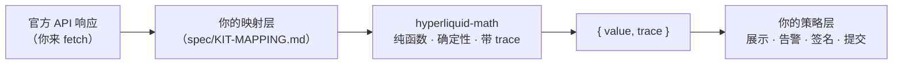

<h1 align="center">hyperliquid-math</h1>

<p align="center">
  基于 decimal 字符串的确定性 Hyperliquid 数学库。<br>
  零网络 I/O；每个结果都带一条计算 trace。
</p>

<p align="center">
  <a href="https://github.com/Minnzen/hyperliquid-math/actions/workflows/ci.yml"></a>
  
  
  
  
  
</p>

<p align="center">
  <a href="README.md">English</a> ·
  <a href="https://minnzen.github.io/hyperliquid-math/">文档站</a> ·
  <a href="spec/CONSUMER-INTEGRATION.md">消费者接入</a> ·
  <a href="spec/README.md">公式手册</a> ·
  <a href="SKILL.md">AI Agent 指南</a>
</p>

---

## 它做什么

- **精确 decimal 运算。** 所有值都是 decimal 字符串，运算基于 40 位有效数字的 decimal；量化取整方向对用户保守——size 和买价向下、卖价向上。金额不经过浮点。
- **每个结果带一条 trace。** 每个函数返回 `{ value, trace }`。trace 记录规范化输入、公式与来源 ID、每一次取整决策和每一条假设，任何一个输出都能追溯到它依据的规则。
- **覆盖需要推导的公式。** 跨保证金 tier 的清算价求根（含 maintenance deduction 与 backstop 阈值）、账户保证金评估、PnL 归因、funding、费用、订单预览、TWAP/scale 排程、账本重放、spot 单位换算、HIP-1/HIP-3 约束、HIP-4 outcome 投影和统一账户监控比率。
- **证据边界明确，不笼统声称完全一致。** 运行时源码保持 100% 测试覆盖；pin 住的官方 Python SDK 提供 4 个明确标为 partial 的 oracle slice，带日期的 live fixtures 提供 24 个 partial slice。其余 slice 均记录为 `not-supported`，没有任何一项被标成服务器公式完全一致。一个[定时/手动线上对拍脚本](scripts/oracles/manual-live-verify.mjs)会在 standard 模式 cross 保证金合计或清算价不一致时失败，不再只打印差异。

## 安装

```sh
npm install hyperliquid-math
```

也可使用 pnpm、yarn 或 bun。包为纯 ESM，要求 Node ≥ 22（也可在浏览器运行——CI 验证
Chromium 下字节级一致）。

源码检出后请运行 `pnpm install --frozen-lockfile && pnpm build`。

## 示例：计算清算价

这个包只负责计算；**取数、确认账户抽象模式和映射是你的代码**。逐字段映射规则见
[`spec/KIT-MAPPING.md`](spec/KIT-MAPPING.md)。下面的例子刻意只支持全部持仓均为 cross 的
standard 模式账户；unified 和 portfolio margin 需要不同的账户聚合，isolated 仓位则需要
独立证明的逐仓保证金值：

```ts
import { calculatePerpLiquidationPrice } from 'hyperliquid-math/liquidation'
import { quantizePrice } from 'hyperliquid-math/precision'

const info = async (body: object) => {
  const response = await fetch('https://api.hyperliquid.xyz/info', {
    method: 'POST',
    headers: { 'Content-Type': 'application/json' },
    body: JSON.stringify(body),
  })
  if (!response.ok) throw new Error(`Hyperliquid info 返回 HTTP ${response.status}`)
  return response.json()
}

const user = '0x…' // standard 模式、持有 cross 仓位的地址
const accountMode = getAccountModeFromYourConfiguration(user) // 由接入方维护，不能在这里猜
if (accountMode !== 'standard') {
  throw new Error('本示例不映射 unified 或 portfolio-margin 账户')
}
const [[meta, ctxs], state] = await Promise.all([
  info({ type: 'metaAndAssetCtxs' }),   // [meta, assetCtxs]，按 universe 下标对齐
  info({ type: 'clearinghouseState', user }),
])

// 官方字段 → Math 输入（number 转字符串；对象逐字段重建）
// cross 清算价取决于整个单 DEX cross 账户
const tables = new Map(meta.marginTables.map(([id, t]) => [id, t.marginTiers]))
const indexByCoin = new Map(meta.universe.map((u, i) => [u.name, i]))
const toPosition = ({ position: p }) => {
  if (p.leverage.type !== 'cross') {
    throw new Error('isolated 仓位需要独立证明的 isolatedMarginValue')
  }
  const i = indexByCoin.get(p.coin)
  if (i === undefined || meta.universe[i] === undefined || ctxs[i] === undefined) {
    throw new Error(`缺少 ${p.coin} 的市场元数据`)
  }
  return {
    asset: { network: 'mainnet', marketKind: 'perp', dex: null, index: i },
    signedSize: p.szi,                       // 自带符号；负数 = 空头
    entryPrice: p.entryPx,
    markPrice: ctxs[i].markPx,               // 官方标记价，本来就是 decimal 字符串
    marginMode: { kind: 'cross' },
    // 低编号 marginTableId 是隐式单层表，不出现在 marginTables 里
    marginTiers: (
      tables.get(meta.universe[i].marginTableId) ??
      [{ lowerBound: '0', maxLeverage: meta.universe[i].maxLeverage }]
    ).map((t) => ({ lowerBound: t.lowerBound, maxLeverage: String(t.maxLeverage) })),
  }
}

const coin = 'BTC'
const i = indexByCoin.get(coin)
if (i === undefined || meta.universe[i] === undefined) {
  throw new Error(`缺少 ${coin} 的市场元数据`)
}
const result = calculatePerpLiquidationPrice({
  targetAsset: { network: 'mainnet', marketKind: 'perp', dex: null, index: i },
  crossAccountValue: state.crossMarginSummary.accountValue,
  positions: state.assetPositions.map(toPosition),
})

if (result.value.status === 'ok') {
  const display = quantizePrice({
    value: result.value.data.liquidationPrice,   // 全精度，如 '57620.2531645569…'
    marketKind: 'perp',
    szDecimals: meta.universe[i].szDecimals,
    rounding: 'down',
  })
  console.log('清算价:', display.value.status === 'ok' && display.value.data.value)
  console.log('距清算的相对距离:', result.value.data.adverseDistanceRatio)
}
```

所有函数遵循同一契约——plain data 进、`{ value, trace }` 出，永不 throw：

```ts
value.status === 'ok'              // → value.data
value.status === 'invalid-input'   // → value.issues: [{ code, path, actual, expected }]
value.status === 'not-applicable'  // → 数学上无解（如零仓位）
value.status === 'indeterminate'   // → 声明的规则不完整
```

校验错误信息很具体——`expected` 直接给出正确的 key 列表或格式，大多数映射错误看一眼报错就能定位。

## 内容一览

| 子路径 | 函数 |
| --- | --- |
| `/precision` | `canonicalizeDecimalString` · `quantizePrice` · `quantizeSize` |
| `/identifiers` | `deriveCanonicalAssetKey` · `encodeAssetId` · `decodeAssetId`（含 outcome asset ID） |
| `/hip4` | `calculateOutcomeDualPrice` · `calculateOutcomeSettlement` · `evaluateRecurringOutcome` |
| `/orderbook` | `calculateBookMetrics` · `simulateBookFill` |
| `/fees` | `calculateTradeFee` · `calculateWeightedFeeVolume` · `selectFeeTier` |
| `/positions` | `calculatePerpUnrealizedPnl` · `projectPerpFill` · `projectPerpFillSequence` · `calculatePerpBreakEvenPrice` |
| `/funding` | `calculateFundingPremiumIndex` · `calculateFundingRate` · `calculateFundingPayment` · `annualizeFundingRate` |
| `/margin` | `calculatePerpInitialMargin` · `calculatePerpMaintenanceMargin` · `evaluatePerpAccountMargin` · `calculateUnifiedAccountRatio` |
| `/liquidation` | `calculatePerpLiquidationPrice` |
| `/scenarios` | `simulatePerpAccountScenario` |
| `/orders` | `validatePerpOrder` · `calculatePerpMaxOrderSize` · `evaluatePerpReduceOnly` · `calculatePerpSlippagePrice` · `classifyPerpTrigger` · `derivePerpTriggerPrice` · `buildPerpScaleLadder` · `calculatePerpTwapSchedule` |
| `/reconciliation` | `replayPerpAccountEvents` · `reconcilePerpAccountSnapshot` |
| `/spot` | `convertSpotTokenUnits` · `calculateSpotOrderDeltas` · `projectSpotPositionEvent` · `calculateSpotPortfolioValue` · `evaluateSpotDustEligibility` · `projectSpotDustAllocation` |
| `/hip1` | `validateHip1Deployment` · `evaluateHip1AnchorGenesisEligibility` |
| `/hip3` | `resolveHip3CollateralSource` · `evaluateHip3MarginMode` · `calculateHip3FeeRates` |

公式推导、49 个可手算的 worked examples、每个函数的 oracle 覆盖状态都在
[spec 手册](spec/README.md)里，随包分发。

## 边界



这个包**刻意不做**：不 fetch、不缓存、不签名、不提交；不判断新鲜度、严重级别或拦截策略；不预测服务器是否接受、队列位置、实际成交、清算执行或 ADL。服务器权威的值（生效费率档位、最终 funding 结算）只作为输入或对照证据，永远不是输出。完整的边界声明见 [`spec/KIT-MAPPING.md`](spec/KIT-MAPPING.md)。

## FAQ

**`dex` 填什么？** 官方 `perpDexs` 里的 builder-dex 名（`'xyz'`、`'flx'` 等）；主 DEX 填 `null`——BTC、ETH 和所有标准 perp 都是 `null`。Spot 一律 `null`。

**为什么输出是 40 位的字符串？** 因为在你告诉它取整方向之前，这个包拒绝替你取整。展示或下单前过一遍 `quantizePrice`/`quantizeSize`，取整方向会被记录进 trace。

**为什么用 decimal 字符串而不是 number？** `0.1 + 0.2 !== 0.3` 不是你希望出现在清算价里的性质。官方响应的多数金额字段本来就是字符串；少数 JSON number（`maxLeverage`、`leverage.value`）用 `String()` 转换。

**Node < 22 能用吗？** 库以 Node 22+ 为 CI 验证的确定性保证范围；运行时只用到 ES2023 + `decimal.js`，更老的 ESM 运行时通常也能跑，但在测试保证之外。

## License

MIT © Zen
